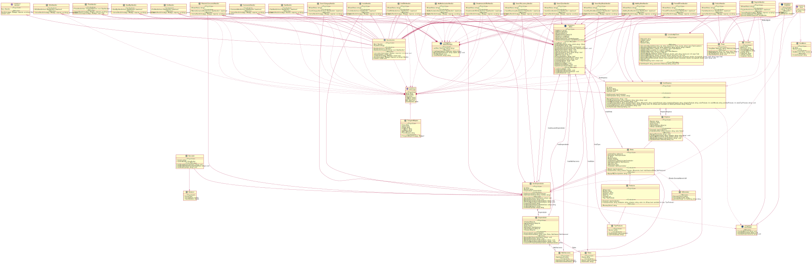

# Equipo14 - Programacion II - Proyecto Final

## Problema/Consigna al que se le da solucion
¿Cómo podemos nosotros, estudiantes de Programación II de la Universidad Católica del Uruguay, ayudar a poner en contacto a las empresas que generan residuos y materiales reciclables, con emprendedores que puedan utilizar esos residuos o materiales en sus propios productos, y de esa forma reducir los desechos que se generan y disminuir el impacto en el ambiente?.

## Solucion
Realzar un Chatbot que permitirá conectar organizaciones o empresas con emprendedores.

## Historias de Usuario
Aquí veremos una explicación general e informal de las funciones del software (nuestro programa), escrita desde la perspectiva del usuario final. Su propósito es articular cómo el software proporcionará una función de valor al cliente.

### Administrador
- [X] Como administrador, quiero poder invitar empresas a la plataforma, para que de esa forma puedan realizar ofertas de materiales reciclables o residuos.

### Empresa
- [X] Como empresa, quiero aceptar una invitación a unirme en la plataforma y registrar mi nombre, ubicación y rubro, para que de esa forma pueda comenzar a publicar ofertas.

- [X] Como empresa, quiero publicar una oferta de materiales reciclables o residuos, para que de esa forma los emprendedores que lo necesiten puedan reutilizarlos.

- [X] Como empresa, quiero clasificar los materiales o residuos, indicar su cantidad y unidad, el valor (en $ o U$S) de los mismos y el lugar donde se ubican, para que de esa forma los emprendedores tengan información de materiales o residuos disponibles.

- [X] Como empresa, quiero indicar las habilitaciones que requiere un emprendedor, para que de esa forma pueda recibir o retirar los materiales o residuos.

- [X] Como empresa, quiero indicar un conjunto de palabras claves asociadas a la publicación de los materiales, para que de esa forma sea más fácil de encontrarlos en las búsquedas que hacen los emprendedores.

- [X] Como empresa, quiero saber todos los materiales o residuos entregados en un período de tiempo, para de esa forma tener un seguimiento de su reutilización.

### Emprendedor
- [X] Como emprendedor, quiero registrarme en la platarforma indicando nombre, ubicación, rubro, habilitaciones y especializaciones, para que de esa forma pueda ver las ofertas de materiales o residuos.

- [X] Como emprendedor, quiero poder buscar materiales ofrecidos por empresas mediante palabras clave, categorías, o por zona, para de esa forma obtener insumos para mi emprendimiento.

- [X] Como emprendedor, quiero saber qué materiales se generan constantemente, para de esa forma planificar que insumos tengo disponibles.

- [X] Como emprendedor, quiero saber cuándo un material o residuo se genera puntualmente, para de esa forma determinar oportunidades de desarrollar nuevos productos.

- [X] Como emprendedor, quiero saber cuántos materiales o residuos consumí en un período de tiempo, para de esa forma tener un control de mis insumos.

## Diagrama de Clases

## Reflexion

Primer entrega:

Nos parecio dificil en un principio el como organizar de forma correcta las clases, es decir, que clases nececitabamos para que, y que responsabilidades debia tener cada una.
A su vez nos costo bastante imaginarnos todo el programa de principio a fin, ya que si bien las pautas eran claras, plasmar las mismas en el codigo de principio a fin se veia un poco borroso.

Por otra parte, compartiendo ideas tanto entre nosotros, con algunos integrantes de otros equipos y con los profesores, pudimos ir armando de a poco la idea general y la estructura del programa.
Aprendimos a utilizar Doxygen y a formular documentacion utilizando comentarios XML, lo cual para nosotros era completamente nuevo.

Segunda entrega:

Tuvimos muchos contratiempos, especialmente para construir la base de la aplicacion dado que no lograbamos entender la consigna en su totalidad. Por esto tuvimos que reescribir varias veces las clases que habiamos creado o modificar las ya existentes. A su vez, a medida que la aplicacion se iba haciendo mas y mas grandes, nos dimos cuenta que nos faltaban mas funcionalidades, por lo cual tuvimos que implementarlas.

Como ya mencionamos antes, debido a la falta de tiempo, algunas funcionalidades quedaron pendientes las cuales posiblemente sean implementada en la entrega final del proyecto.

Tercera entrega:

Para la entrega final ya nos sentiamos un poco mas comodos con el codigo. Nos llevo tiempo pero formamos una buena estructura para el programa de modo que pudieramos reutilizar y agilizar el trabajo. Esto nos dio tiempo para pulir algunas otras cosas y pensar algunas otras con un poco mas de libertad.

El desafío central era lograr la manera de realizar una lógica funcional que pudiera replicar lo que realizábamos en base a métodos en el Program. Claramente, al aprender del patrón Chain of Responsibility una gran parte de ese problema se solucionó, pero hacer que el bot pueda mantener una conversación, adaptarnos a las herramientas que provee una API de mensajería y utilizarlas a nuestro favor, como mantener a los usuarios fuera de métodos en los que no deberían de entrar ahora que no usamos métodos de clase para interactuar entre las clases son desafíos que con el tiempo logramos solventar y llegamos a un punto en el que estamos satisfechos.

A diferencia de las instancias anteriores, para esta ultima ya teniamos una estructura, lo que mas nos dificulto fue la implementacion de los handlers y pensar como guardar los datos de forma temporal. 

## Recursos
[refactoring.guru/design-patterns](https://refactoring.guru/design-patterns)